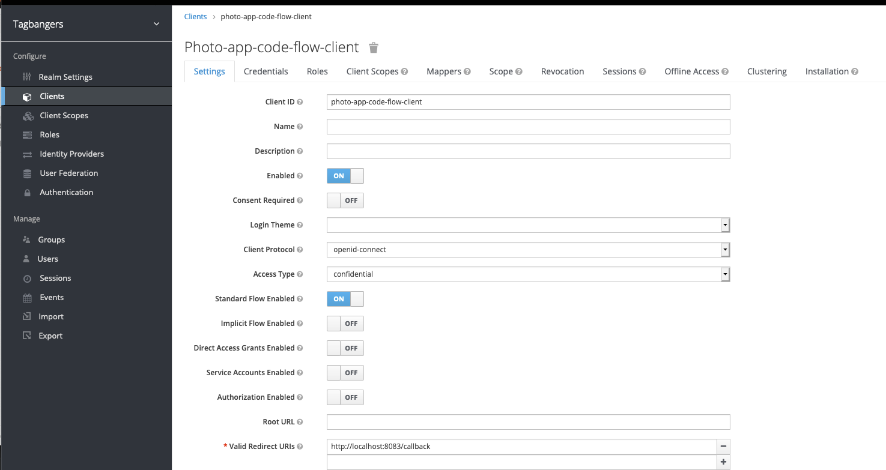
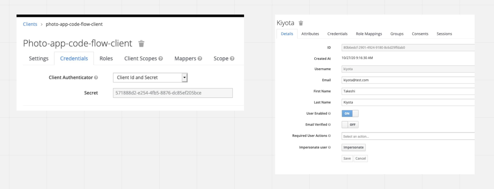
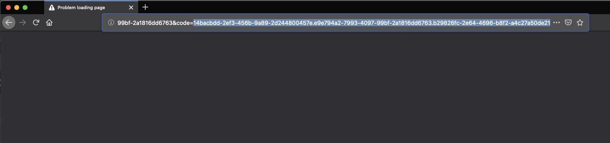
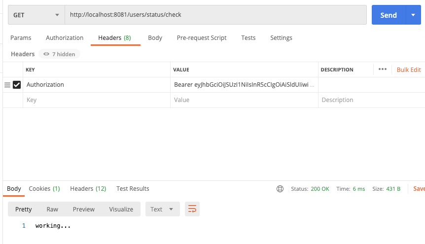

# Resource Server

## Requirements

- Keycloak configuration(running port 8080 this time)
    - keycloak-client-settings

    - keycloak-client-credential-and-user-settings


- access browser getting authorization code

```
http://localhost:8080/auth/realms/tagbangers/protocol/openid-connect/auth?client_id=photo-app-code-flow-client&response_type=code&scope=openid profile&redirect_uri=http://localhost:8083/callback&state=tagbangers
```



- get access token and refresh token

```shell
# client-id,client-secret and redirect_url can checked on Keycloak
# code is responsed authorization code
curl --location --request POST 'localhost:8080/auth/realms/tagbangers/protocol/openid-connect/token' \
--header 'Accept-Language: tr' \
--header 'Content-Type: application/x-www-form-urlencoded' \
--data-urlencode 'grant_type=authorization_code' \
--data-urlencode 'client_id=photo-app-code-flow-client' \
--data-urlencode 'client_secret=571888d2-e254-4fb5-8876-dc85ef205bce' \
--data-urlencode 'code=21cdff7c-00db-425d-9515-298f4206753f.7b546257-e161-4af3-8e41-fc0c57872917.b29826fc-2e64-4696-b8f2-a4c27a50de21' \
--data-urlencode 'redirect_uri=http://localhost:8083/callback' \
--data-urlencode 'scope=openid profile'
```

- access resource server


